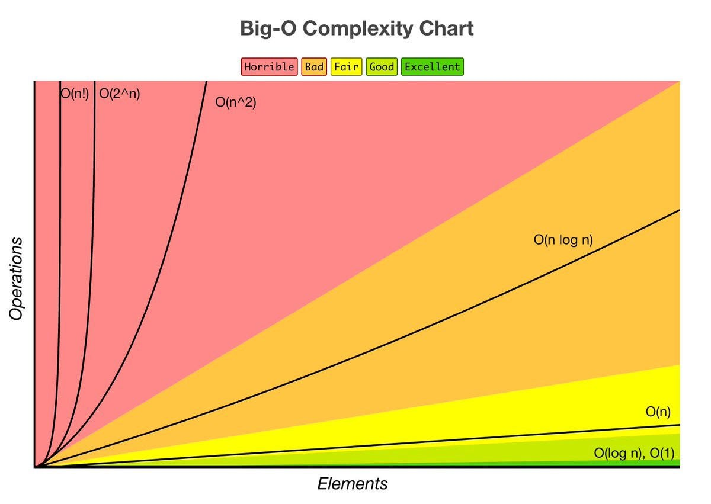

# Running Time

## Big O Notation
Big O notation removes the need for knowing the exact measurments of the timing of an algorithm, rather just the shape it creates, i.e. $O(n/2)$ and $O(n)$ are the same as $O(n)$.

*"O"* is described as *"the worst case scenario"*, so for example with linear search, you could get it on the first try by luck, however the worst case is that you will have to search through all *n* points, therefore it is $O(n)$.

### $O(n^2)$, Quadratic Time.
$O(n^2)$ is typically when a double `for` loop happens. This means that every data point is relating to every other data point, i.e.
```c
#include <stdio.h>

int main(){
    int arr[] = {1, 2, 3, 4};
    int arr_len = 4;

    for(int i = 0; i < arr_len; i++){
        for(int j = 0; j < arr_len; j++){
            printf("%i + %i = %i\n", arr[i], arr[j], arr[i] + arr[j]);
        }
    }
}
```

```
OUTPUT:
1 + 1 = 2
1 + 2 = 3
1 + 3 = 4
1 + 4 = 5
2 + 1 = 3
2 + 2 = 4
2 + 3 = 5
2 + 4 = 6
3 + 1 = 4
3 + 2 = 5
3 + 3 = 6
3 + 4 = 7
4 + 1 = 5
4 + 2 = 6
4 + 3 = 7
4 + 4 = 8
```

This therefore ran 16 times with 4 data points: $4^2 = 16$.

### $O(n)$, Linear Time.
$O(n)$ is linear, the amount of processing time to data is proportional, i.e.

```c
#include <stdio.h>

int lin_search(int arr_len, int* arr, int target);

int main(){
    int arr[] = {1, 2, 3, 4};
    int arr_len = 4;
    int target = 4;

    int lin_search_result = lin_search(arr_len, arr, target);

    if(lin_search_result == -1){
        printf("Target: %i not found.\n", target);
    } else {
        printf("Target: %i found at index %i\n", target, lin_search_result);
    }
}

int lin_search(int arr_len, int* arr, int target){
    for(int i = 0; i < arr_len; i++){
        if(arr[i] == target){
            return i;
        }
    }

    return -1;
}

```

```
OUTPUT:
Target: 4 found at index 3
```

The worst case for this would've been looking through the entire dataset, therefore $n = 4$, $4 = 4$.

### $O(\log(n))$, Logarithmic Time.
This means that the growth of time dependent on data points decreases the more you give, giving you a logarithmic shape. It typically uses the *"divide-and-conquer"* technique, i.e. with binary search:
```c
#include <stdio.h>

int bin_search(int arr_len, int* arr, int target);

int main(int argc, char* argv[]){
    int arr[] = {1, 2, 3, 4};
    int arr_len = 4;
    int target = 3;

    int bin_search_result = bin_search(arr_len, arr, target);
    if(bin_search_result == -1){
        printf("Target: %i not found.\n", target);
    } else{
        printf("Target: %i found at index %i\n", target, bin_search_result);
    }
}

int bin_search(int arr_len, int* arr, int target){
    int start = 0;
    int end = arr_len - 1;

    while(start <= end){
        int middle = start + (end - start) / 2;
        if(target == arr[middle]){
              return middle;
        } else if(target > arr[middle]){
              start = middle + 1;
        } else if(target < arr[middle]){
              end = middle;
        }
    }

    return -1;
}
```

```
OUTPUT:
Target: 3 found at index 2
```

This means that through each iteration, the amount of data to process halves, meaning that we have a logarithmic shape.

### $O(1)$, Constant Time.
This means that the algorithm is not dependent on the amount of data, and is always a constant time, i.e.

```c
#include <stdio.h>

int main(){
    int arr[] = {1, 2, 3, 4};
    int arr_len = 4;

    printf("The first item is: $i\n", arr[0]);
}
```

```
OUTPUT:
The first item is 1
```

This would always return the first item in the array, therefore if there was 100 data points in the array, it would still take just as long to return the first item, therfore the time is always going to be the same.

## Ω Notation
While Big O notation refers to the worst case scenario, Ω refers to the best case scenario of an algorithm.

Most searching algorithms come under $\Omega(1)$ because you might get lucky and get it on your first try, the most famous / ridiculous of these algorithms would be *"Bogo sort"* where a random permutation of the dataset is made everytime, eventually it could be the sorted dataset, however best case scenario it could be done on it's first attempt, therefore making it $\Omega(1)$.

## Θ Notation
Θ Notation is when Ω and O are the same. For example, in this algorithm the best case scenario is $n$, as well as the worst case scenario as it always has to go through all characters. This therefore means that this is $\Theta(n)$

```c
#include <stdio.h>

int main(){
    char str[] = "Hello, world";
    int str_len = 0;

    while(str[str_len] != '\0'){
        str_len++;
    }

    printf("The length of \"%s\" is %i\n", str, str_len);
}
```

## Shapes of Algorithms

