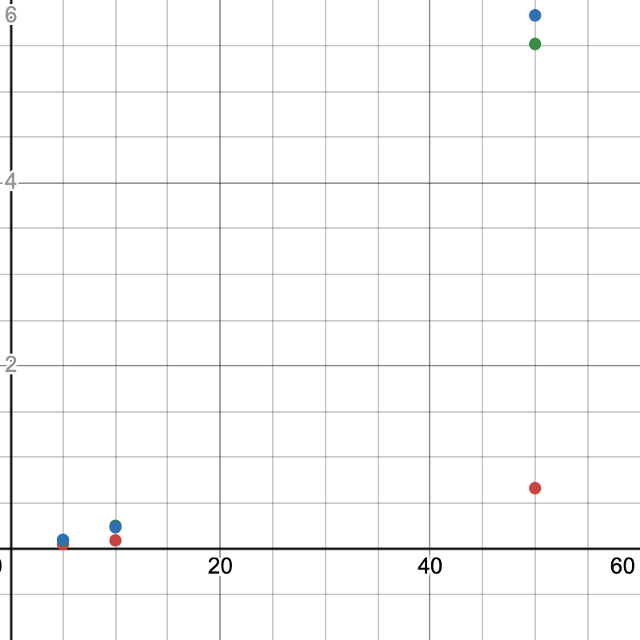
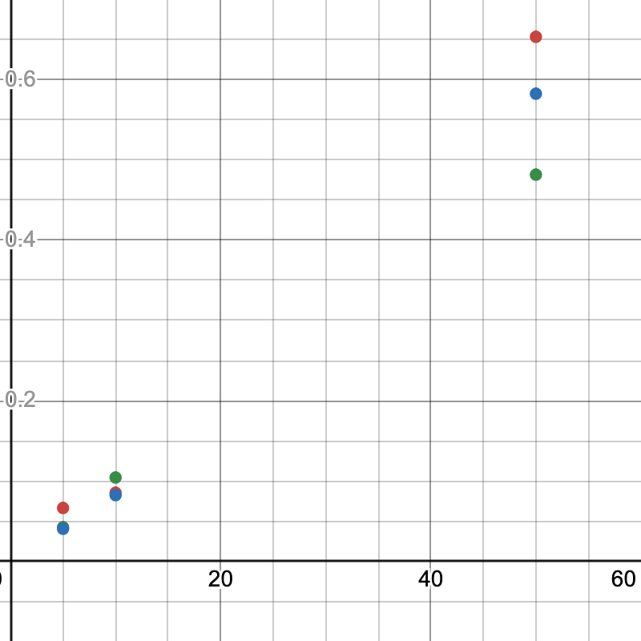
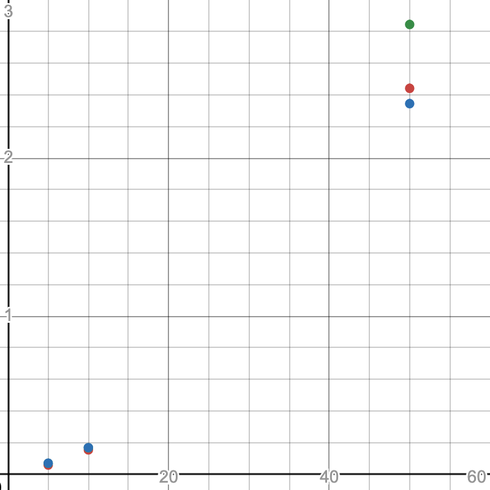

# Reasoning

## Experiment

I will create a python script to get the average of each sorting algorithm with each data set to analyse

```py
import subprocess
import time

def get_time(algo, data_type, data_size):
    start_time = time.time()
    subprocess.run(f"./{algo} {data_type}{data_size}.txt", shell=True, check=True, cwd="./sort")
    end_time = time.time()
    return end_time - start_time

def get_average(algo, data_type, data_size, sample_size):
    samples = []
    total_time = 0
    for i in range(sample_size):
        time = get_time(algo, data_type, data_size)
        total_time += time
        samples.append(float(str(round(time, 5))[:5]))

        average = round(total_time / sample_size, 3)

    data = {
        "average": average,
        "samples": samples
    }

    return data


def main():
    algos = ["sort1", "sort2", "sort3"]
    data_types = ["sorted", "reversed", "random"]
    data_sizes = [5_000, 10_000, 50_000]

    data = dict()

    for algo in algos:
        data[algo] = dict()
        for data_type in data_types:
            for data_size in data_sizes:
                data[algo][f"{data_type}{data_size}"] = get_average(algo, data_type, data_size, 10)

    print(data)

main()
```

Here are the results:
```py
{
    "sort1": {
        "sorted5000": {
            "average": 0.047,
            "samples": [
                0.033,
                0.037,
                0.033,
                0.034,
                0.066,
                0.054,
                0.032,
                0.065,
                0.069,
                0.044,
            ],
        },
        "sorted10000": {
            "average": 0.09,
            "samples": [
                0.088,
                0.072,
                0.077,
                0.068,
                0.08,
                0.09,
                0.085,
                0.097,
                0.093,
                0.143,
            ],
        },
        "sorted50000": {
            "average": 0.66,
            "samples": [
                0.754,
                0.458,
                0.538,
                2.233,
                0.513,
                0.418,
                0.41,
                0.362,
                0.425,
                0.48,
            ],
        },
        "reversed5000": {
            "average": 0.089,
            "samples": [
                0.153,
                0.109,
                0.077,
                0.073,
                0.089,
                0.082,
                0.076,
                0.076,
                0.076,
                0.072,
            ],
        },
        "reversed10000": {
            "average": 0.25,
            "samples": [
                0.241,
                0.25,
                0.244,
                0.258,
                0.284,
                0.29,
                0.222,
                0.236,
                0.232,
                0.243,
            ],
        },
        "reversed50000": {
            "average": 5.519,
            "samples": [
                5.426,
                5.003,
                7.176,
                4.881,
                6.557,
                4.851,
                6.852,
                4.872,
                4.646,
                4.916,
            ],
        },
        "random5000": {
            "average": 0.097,
            "samples": [
                0.07,
                0.057,
                0.053,
                0.346,
                0.092,
                0.065,
                0.064,
                0.071,
                0.071,
                0.077,
            ],
        },
        "random10000": {
            "average": 0.234,
            "samples": [
                0.209,
                0.19,
                0.208,
                0.223,
                0.214,
                0.217,
                0.369,
                0.238,
                0.258,
                0.213,
            ],
        },
        "random50000": {
            "average": 5.832,
            "samples": [
                5.586,
                5.466,
                6.502,
                5.416,
                6.119,
                5.581,
                6.776,
                5.476,
                5.783,
                5.614,
            ],
        },
    },
    "sort2": {
        "sorted5000": {
            "average": 0.066,
            "samples": [
                0.041,
                0.045,
                0.073,
                0.103,
                0.071,
                0.04,
                0.048,
                0.09,
                0.07,
                0.069,
            ],
        },
        "sorted10000": {
            "average": 0.085,
            "samples": [
                0.099,
                0.073,
                0.14,
                0.068,
                0.064,
                0.075,
                0.087,
                0.081,
                0.081,
                0.076,
            ],
        },
        "sorted50000": {
            "average": 0.654,
            "samples": [
                0.407,
                0.494,
                0.718,
                0.579,
                1.966,
                0.673,
                0.403,
                0.515,
                0.424,
                0.351,
            ],
        },
        "reversed5000": {
            "average": 0.042,
            "samples": [
                0.04,
                0.056,
                0.035,
                0.037,
                0.055,
                0.033,
                0.037,
                0.036,
                0.048,
                0.038,
            ],
        },
        "reversed10000": {
            "average": 0.104,
            "samples": [
                0.075,
                0.14,
                0.108,
                0.145,
                0.067,
                0.129,
                0.07,
                0.144,
                0.091,
                0.066,
            ],
        },
        "reversed50000": {
            "average": 0.482,
            "samples": [
                0.522,
                0.536,
                0.449,
                0.649,
                0.566,
                0.402,
                0.451,
                0.391,
                0.394,
                0.458,
            ],
        },
        "random5000": {
            "average": 0.04,
            "samples": [
                0.047,
                0.038,
                0.047,
                0.05,
                0.044,
                0.032,
                0.035,
                0.036,
                0.034,
                0.035,
            ],
        },
        "random10000": {
            "average": 0.082,
            "samples": [
                0.089,
                0.113,
                0.087,
                0.081,
                0.071,
                0.075,
                0.086,
                0.085,
                0.062,
                0.066,
            ],
        },
        "random50000": {
            "average": 0.583,
            "samples": [
                2.092,
                0.524,
                0.342,
                0.421,
                0.385,
                0.428,
                0.445,
                0.485,
                0.339,
                0.365,
            ],
        },
    },
    "sort3": {
        "sorted5000": {
            "average": 0.058,
            "samples": [
                0.053,
                0.058,
                0.047,
                0.047,
                0.054,
                0.051,
                0.044,
                0.058,
                0.052,
                0.111,
            ],
        },
        "sorted10000": {
            "average": 0.154,
            "samples": [
                0.145,
                0.137,
                0.143,
                0.176,
                0.162,
                0.148,
                0.191,
                0.148,
                0.153,
                0.135,
            ],
        },
        "sorted50000": {
            "average": 2.441,
            "samples": [
                2.184,
                4.073,
                2.415,
                2.41,
                2.083,
                2.313,
                2.339,
                2.178,
                2.146,
                2.259,
            ],
        },
        "reversed5000": {
            "average": 0.069,
            "samples": [
                0.05,
                0.047,
                0.048,
                0.05,
                0.056,
                0.051,
                0.056,
                0.096,
                0.123,
                0.103,
            ],
        },
        "reversed10000": {
            "average": 0.167,
            "samples": [
                0.165,
                0.179,
                0.145,
                0.151,
                0.147,
                0.167,
                0.148,
                0.221,
                0.175,
                0.171,
            ],
        },
        "reversed50000": {
            "average": 2.845,
            "samples": [
                2.903,
                2.447,
                2.331,
                2.364,
                4.069,
                2.504,
                2.412,
                2.618,
                4.185,
                2.608,
            ],
        },
        "random5000": {
            "average": 0.07,
            "samples": [
                0.093,
                0.064,
                0.071,
                0.128,
                0.054,
                0.056,
                0.058,
                0.051,
                0.055,
                0.067,
            ],
        },
        "random10000": {
            "average": 0.168,
            "samples": [
                0.156,
                0.132,
                0.191,
                0.143,
                0.252,
                0.137,
                0.14,
                0.187,
                0.151,
                0.183,
            ],
        },
        "random50000": {
            "average": 2.344,
            "samples": [
                2.297,
                2.562,
                2.527,
                2.302,
                2.135,
                2.251,
                2.171,
                2.853,
                2.157,
                2.177,
            ],
        },
    },
}
```

Which in turn looks like this:

| Algorithm | Data Set      | Samples                                                                | Average |
|-----------|---------------|------------------------------------------------------------------------|---------|
| sort1     | sorted5000    | [0.033, 0.037, 0.033, 0.034, 0.066, 0.054, 0.032, 0.065, 0.069, 0.044] | 0.047   |
| sort1     | sorted10000   | [0.088, 0.072, 0.077, 0.068, 0.08, 0.09, 0.085, 0.097, 0.093, 0.143]   | 0.09    |
| sort1     | sorted50000   | [0.754, 0.458, 0.538, 2.233, 0.513, 0.418, 0.41, 0.362, 0.425, 0.48]   | 0.66    |
| sort1     | reversed5000  | [0.153, 0.109, 0.077, 0.073, 0.089, 0.082, 0.076, 0.076, 0.076, 0.072] | 0.089   |
| sort1     | reversed10000 | [0.241, 0.25, 0.244, 0.258, 0.284, 0.29, 0.222, 0.236, 0.232, 0.243]   | 0.25    |
| sort1     | reversed50000 | [5.426, 5.003, 7.176, 4.881, 6.557, 4.851, 6.852, 4.872, 4.646, 4.916] | 5.519   |
| sort1     | random5000    | [0.07, 0.057, 0.053, 0.346, 0.092, 0.065, 0.064, 0.071, 0.071, 0.077]  | 0.097   |
| sort1     | random10000   | [0.209, 0.19, 0.208, 0.223, 0.214, 0.217, 0.369, 0.238, 0.258, 0.213]  | 0.234   |
| sort1     | random50000   | [5.586, 5.466, 6.502, 5.416, 6.119, 5.581, 6.776, 5.476, 5.783, 5.614] | 5.832   |
| sort2     | sorted5000    | [0.041, 0.045, 0.073, 0.103, 0.071, 0.04, 0.048, 0.09, 0.07, 0.069]    | 0.066   |
| sort2     | sorted10000   | [0.099, 0.073, 0.14, 0.068, 0.064, 0.075, 0.087, 0.081, 0.081, 0.076]  | 0.085   |
| sort2     | sorted50000   | [0.407, 0.494, 0.718, 0.579, 1.966, 0.673, 0.403, 0.515, 0.424, 0.351] | 0.654   |
| sort2     | reversed5000  | [0.04, 0.056, 0.035, 0.037, 0.055, 0.033, 0.037, 0.036, 0.048, 0.038]  | 0.042   |
| sort2     | reversed10000 | [0.075, 0.14, 0.108, 0.145, 0.067, 0.129, 0.07, 0.144, 0.091, 0.066]   | 0.104   |
| sort2     | reversed50000 | [0.522, 0.536, 0.449, 0.649, 0.566, 0.402, 0.451, 0.391, 0.394, 0.458] | 0.482   |
| sort2     | random5000    | [0.047, 0.038, 0.047, 0.05, 0.044, 0.032, 0.035, 0.036, 0.034, 0.035]  | 0.04    |
| sort2     | random10000   | [0.089, 0.113, 0.087, 0.081, 0.071, 0.075, 0.086, 0.085, 0.062, 0.066] | 0.082   |
| sort2     | random50000   | [2.092, 0.524, 0.342, 0.421, 0.385, 0.428, 0.445, 0.485, 0.339, 0.365] | 0.583   |
| sort3     | sorted5000    | [0.053, 0.058, 0.047, 0.047, 0.054, 0.051, 0.044, 0.058, 0.052, 0.111] | 0.058   |
| sort3     | sorted10000   | [0.145, 0.137, 0.143, 0.176, 0.162, 0.148, 0.191, 0.148, 0.153, 0.135] | 0.154   |
| sort3     | sorted50000   | [2.184, 4.073, 2.415, 2.41, 2.083, 2.313, 2.339, 2.178, 2.146, 2.259]  | 2.441   |
| sort3     | reversed5000  | [0.05, 0.047, 0.048, 0.05, 0.056, 0.051, 0.056, 0.096, 0.123, 0.103]   | 0.069   |
| sort3     | reversed10000 | [0.165, 0.179, 0.145, 0.151, 0.147, 0.167, 0.148, 0.221, 0.175, 0.171] | 0.167   |
| sort3     | reversed50000 | [2.903, 2.447, 2.331, 2.364, 4.069, 2.504, 2.412, 2.618, 4.185, 2.608] | 2.845   |
| sort3     | random5000    | [0.093, 0.064, 0.071, 0.128, 0.054, 0.056, 0.058, 0.051, 0.055, 0.067] | 0.07    |
| sort3     | random10000   | [0.156, 0.132, 0.191, 0.143, 0.252, 0.137, 0.14, 0.187, 0.151, 0.183]  | 0.168   |
| sort3     | random50000   | [2.297, 2.562, 2.527, 2.302, 2.135, 2.251, 2.171, 2.853, 2.157, 2.177] | 2.344   |

# Findings

> Graph's Key
> Red: sorted
> Green: reversed
> Blue: random

## sort1


Looking at the graph, you can see that the sorted data is going quicker than the unsorted data, meaning that this is not a Θ algorithm. This makes me think this is bubble sort as this is the only one where Θ is not true.

## sort2


Looking at this graph, you can see that all the data points follow a simmilar pattern, however they all take a short amount of time. As well as this, you can see in the red plot that it almost follows a $n\log(n)$ pattern with the second point being lower than the first. This makes me believe that this is merge sort.

## sort3


Finally, this graph shows an exponential growth with no difference between sorted and unsorted. This makes me believe that this is selection sort as the max times where a lot longer than that of sort2.

# Final Conclusion
- sort1: Bubble Sort due to sorted data being quicker than unsorted.
- sort2: Merge Sort due to $n\log(n)$ looking shape on sorted data and quicker than sort3
- sort3: Selection Sort due to Θ data as well as taking longer than sort2
